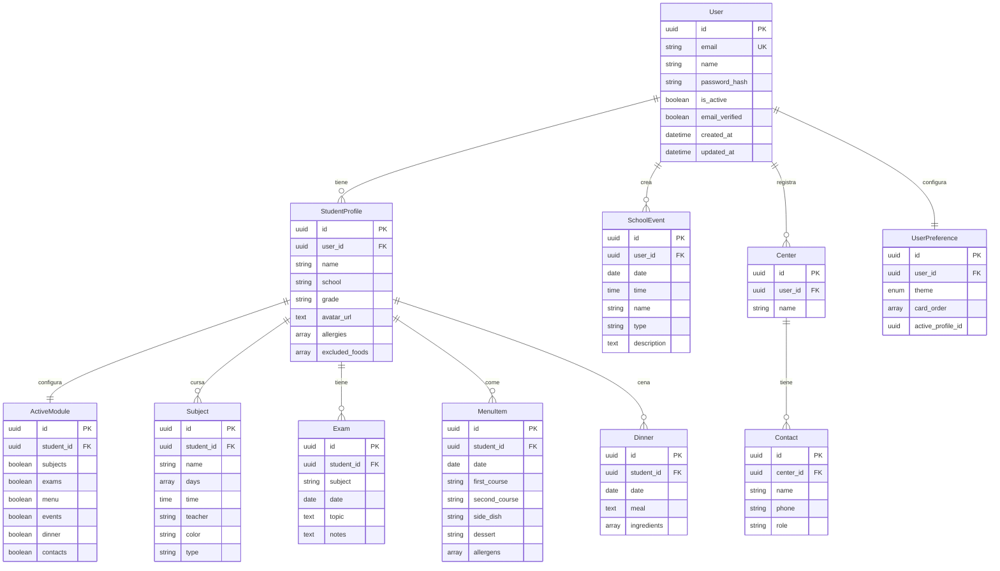

# Agenda Escolar Pro

Aplicacion web para que padres y madres gestionen la vida escolar de sus hijos: asignaturas, examenes, menu del comedor, eventos y **sugerencias de cena con IA** que complementan el menu del colegio.

> Trabajo de Fin de Master - Master en Desarrollo con IA, BIG School (2025-2026)

---

## Demo

| Entorno | URL |
|---------|-----|
| Frontend (Vercel) | https://agenda-escolar-sage.vercel.app |
| Backend API (Render) | https://agenda-escolar-pnpk.onrender.com |
| API Docs (Swagger) | https://agenda-escolar-pnpk.onrender.com/docs |

---

## Funcionalidades principales

- **Multi-perfil**: gestiona varios hijos desde una misma cuenta
- **Asignaturas**: horario de clases del colegio y extraescolares con color, dia y profesor
- **Examenes**: registro de pruebas con fecha, tema y notas
- **Menu escolar**: menu diario del comedor (primer plato, segundo, postre, alergenos)
- **Eventos escolares**: calendario con festivos, lectivos y vacaciones
- **Sugerencias de cena con IA**: genera cenas complementarias al menu del colegio, respetando alergias y alimentos excluidos
- **Plan semanal de cenas**: planificacion automatica de cenas para la semana
- **Lista de la compra con IA**: genera lista categorizada a partir de las cenas planificadas
- **Modulos activables**: cada perfil puede activar/desactivar funcionalidades (asignaturas, examenes, menu, eventos, cenas, contactos)
- **Modo oscuro**: tema claro/oscuro con persistencia
- **Autenticacion JWT**: registro, login y proteccion de endpoints con tokens

---

## Stack tecnologico

| Capa | Tecnologia | Version |
|------|-----------|---------|
| Frontend | React + TypeScript | 19.2 / 5.8 |
| Build tool | Vite | 6.2 |
| Estilos | Tailwind CSS | CDN |
| Backend | FastAPI + Python | 0.115.6 / 3.11 |
| ORM | SQLAlchemy + Alembic | 2.0.36 / 1.14 |
| Base de datos | PostgreSQL (Supabase) | 15 |
| IA (frontend) | @google/genai | 1.38 |
| IA (backend) | google-generativeai | 0.8.3 |
| Modelo IA | Gemini 3 Flash Preview | - |
| Auth | python-jose + bcrypt | JWT RS256/HS256 |
| Testing frontend | Vitest + jsdom | 1.1 |
| Testing backend | pytest + httpx + testcontainers | 8.3 |
| Linting | ESLint / Black + flake8 + mypy + isort | - |
| CI/CD | GitHub Actions | - |
| Deploy frontend | Vercel | - |
| Deploy backend | Render | - |

---

## Arquitectura del sistema


### Clean Architecture (backend)


---

## Estructura de carpetas

```
Agenda-escolar/
├── .github/
│   └── workflows/
│       ├── frontend-ci.yml          # CI: lint, typecheck, test, build
│       └── backend-ci.yml           # CI: lint, test, deploy a Render
├── frontend/
│   ├── app/                         # Paginas (Home, Manage, Profile, Dinners)
│   ├── components/                  # Componentes reutilizables
│   ├── hooks/                       # Custom hooks (useLocalStorage)
│   ├── services/
│   │   └── aiService.ts             # Integracion con Gemini AI
│   ├── tests/unit/                  # Tests unitarios
│   ├── utils/                       # Utilidades
│   ├── types.ts                     # Interfaces TypeScript
│   ├── App.tsx                      # Componente raiz y gestion de estado
│   ├── index.html                   # Entry point
│   ├── vite.config.ts               # Configuracion Vite
│   └── package.json
├── backend/
│   ├── src/
│   │   ├── domain/
│   │   │   └── models.py            # Modelos SQLAlchemy (User, Student, etc.)
│   │   ├── application/
│   │   │   ├── use_cases/           # Casos de uso
│   │   │   └── schemas/             # Schemas Pydantic (DTOs)
│   │   ├── infrastructure/
│   │   │   ├── api/
│   │   │   │   ├── routes/          # Endpoints (auth, students, menus, etc.)
│   │   │   │   └── dependencies/    # Inyeccion de dependencias
│   │   │   ├── repositories/        # Repositorios de datos
│   │   │   ├── services/            # Servicios externos
│   │   │   ├── security/            # JWT y hashing de passwords
│   │   │   ├── config.py            # Configuracion
│   │   │   └── database.py          # Conexion a BD
│   │   └── main.py                  # Entry point FastAPI
│   ├── migrations/
│   │   └── versions/                # Migraciones Alembic
│   ├── tests/
│   │   ├── unit/                    # Tests unitarios
│   │   └── integration/             # Tests de integracion
│   ├── requirements.txt             # Dependencias produccion
│   ├── requirements-dev.txt         # Dependencias desarrollo
│   └── alembic.ini                  # Configuracion Alembic
├── docs/                            # Documentacion adicional
├── CLAUDE.md                        # Instrucciones para Claude Code
└── README.md                        # Este archivo
```

---

## Modelo de datos



---

## Instalacion y ejecucion

### Prerequisitos

- Node.js 20+ y npm
- Python 3.11+
- PostgreSQL 15+ (o cuenta en Supabase)
- API Key de Google Gemini

### Frontend

```bash
cd frontend

# Instalar dependencias
npm install

# Configurar variables de entorno
cp .env.example .env.local
# Editar .env.local con tu API Key de Gemini

# Arrancar servidor de desarrollo (http://localhost:3000)
npm run dev

# Build de produccion
npm run build
```

### Backend

```bash
cd backend

# Crear entorno virtual
python -m venv venv
source venv/bin/activate   # Linux/Mac
# venv\Scripts\activate    # Windows

# Instalar dependencias
pip install -r requirements.txt
pip install -r requirements-dev.txt   # Solo desarrollo

# Configurar variables de entorno
cp .env.example .env
# Editar .env con DATABASE_URL, SECRET_KEY, etc.

# Ejecutar migraciones
alembic upgrade head

# Arrancar servidor de desarrollo (http://localhost:8000)
uvicorn src.main:app --reload
```

---

## Testing

### Frontend

```bash
cd frontend

npm run test              # Ejecutar tests
npm run test:watch        # Tests en modo watch
npm run test:coverage     # Tests con cobertura
```

### Backend

```bash
cd backend

pytest                        # Ejecutar todos los tests
pytest tests/unit             # Solo tests unitarios
pytest tests/integration      # Solo tests de integracion
pytest -v --cov               # Tests con cobertura detallada
```

---

## CI/CD

El proyecto usa **GitHub Actions** con dos pipelines:

### Frontend (`frontend-ci.yml`)

Se ejecuta en push a `main` cuando hay cambios en `frontend/`:

1. Setup Node.js 20 con cache de npm
2. `npm ci` - Instalacion de dependencias
3. ESLint - Lint (max 200 warnings)
4. `tsc --noEmit` - Verificacion de tipos
5. `npm test` - Tests con Vitest
6. `npm run build` - Build de produccion
7. Resumen del tamano del build

### Backend (`backend-ci.yml`)

Se ejecuta en push a `main` cuando hay cambios en `backend/`:

1. Setup Python 3.11 con cache de pip
2. PostgreSQL 15 como servicio para tests
3. Instalacion de dependencias
4. Calidad de codigo: Black, isort, flake8, mypy
5. Tests unitarios con cobertura
6. Tests de integracion
7. **Auto-deploy a Render** si los tests pasan en `main`

---

## Integracion con IA

La aplicacion usa **Google Gemini 3 Flash Preview** para tres funcionalidades:

### 1. Sugerencia de cena diaria

Dado el menu del colegio (primer y segundo plato), genera una cena complementaria que evita repetir ingredientes.

### 2. Plan semanal de cenas

A partir del menu escolar de la semana, genera un plan de cenas para 5 dias con variedad nutricional.

### 3. Lista de la compra

Recibe las cenas planificadas y genera una lista de ingredientes organizada por categorias (verduras, carnes, lacteos, etc.).

### Estrategia de prompting

- **Respuesta estructurada**: todas las llamadas usan `responseMimeType: 'application/json'` con `responseSchema` definido, garantizando que la respuesta es JSON parseable
- **Respeto a restricciones**: las alergias y alimentos excluidos del perfil del alumno se inyectan en cada prompt como restricciones estrictas
- **Contexto nutricional**: el menu escolar se incluye como contexto para que la IA sugiera cenas complementarias

### Ejemplo de prompt (simplificado)

```
Sugiere una cena para hoy considerando que para comer hubo: Lentejas con verduras.
RESTRICCIONES: EVITA estrictamente: gluten, lactosa. NO incluyas estos ingredientes: marisco.
Responde en JSON con el campo "meal".
```

---

## IA Responsable

### Privacidad de datos de menores

- La IA **no recibe datos identificativos** del menor (nombre, colegio, curso). Solo recibe el menu escolar y las restricciones alimentarias
- Los datos de perfiles se almacenan unicamente en la base de datos del backend, no se envian al modelo
- Las API Keys de Gemini se gestionan como variables de entorno, nunca en el codigo fuente

### Limitaciones del modelo

- Las sugerencias de cena son **orientativas** y no sustituyen el consejo de un nutricionista
- El modelo puede no conocer platos locales o regionales especificos
- Las restricciones por alergias se envian como instrucciones al modelo, pero **no se garantiza al 100%** que no mencione un alergeno; la responsabilidad final es del padre/madre

### Transparencia

- El usuario ve claramente que las sugerencias son generadas por IA
- Los prompts son auditables en el codigo fuente (`frontend/services/aiService.ts`)
- No se recopilan datos de uso de la IA para entrenamiento de modelos

---

## Variables de entorno

### Frontend (`frontend/.env.local`)

| Variable | Descripcion |
|----------|------------|
| `GEMINI_API_KEY` | API Key de Google Gemini |

### Backend (`backend/.env`)

| Variable | Descripcion |
|----------|------------|
| `DATABASE_URL` | URL de conexion a PostgreSQL |
| `SECRET_KEY` | Clave secreta para firmar JWT |
| `ALGORITHM` | Algoritmo JWT (por defecto HS256) |
| `ACCESS_TOKEN_EXPIRE_MINUTES` | Duracion del access token en minutos |
| `CORS_ORIGINS` | Origenes permitidos (separados por coma) |
| `GEMINI_API_KEY` | API Key de Google Gemini |

---

## API Endpoints

| Metodo | Ruta | Descripcion |
|--------|------|-------------|
| POST | `/api/v1/auth/register` | Registro de usuario |
| POST | `/api/v1/auth/login` | Login (devuelve JWT) |
| GET | `/api/v1/students` | Listar perfiles de alumnos |
| POST | `/api/v1/students` | Crear perfil de alumno |
| GET | `/api/v1/subjects` | Listar asignaturas |
| POST | `/api/v1/subjects` | Crear asignatura |
| GET | `/api/v1/exams` | Listar examenes |
| POST | `/api/v1/exams` | Crear examen |
| GET | `/api/v1/menus` | Listar menus |
| POST | `/api/v1/menus` | Crear menu |
| GET | `/api/v1/dinners` | Listar cenas |
| POST | `/api/v1/dinners` | Crear/sugerir cena |
| GET | `/api/v1/events` | Listar eventos |
| POST | `/api/v1/events` | Crear evento |
| GET/PUT | `/api/v1/active_modules/{student_id}` | Modulos activos por alumno |
| GET | `/health` | Health check |

> Documentacion completa con Swagger en: https://agenda-escolar-pnpk.onrender.com/docs

---

## Licencia

Proyecto academico - Trabajo de Fin de Master, BIG School (2025-2026).
